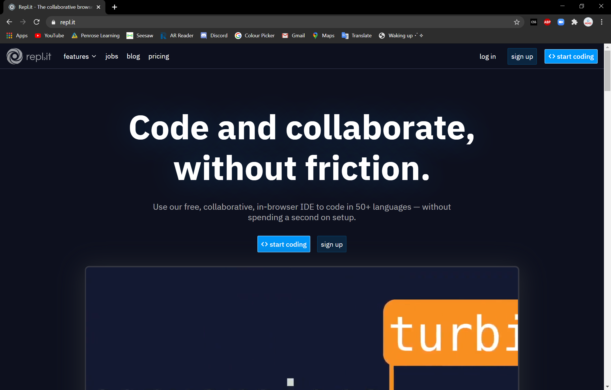
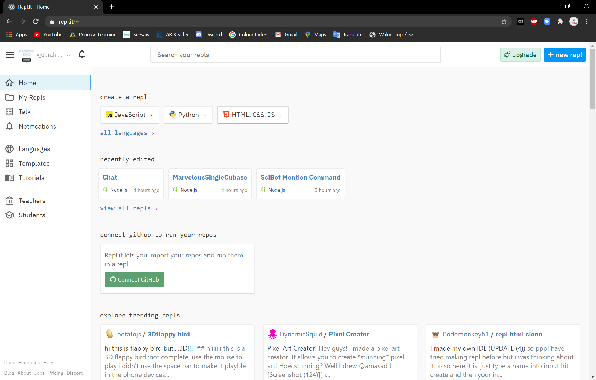
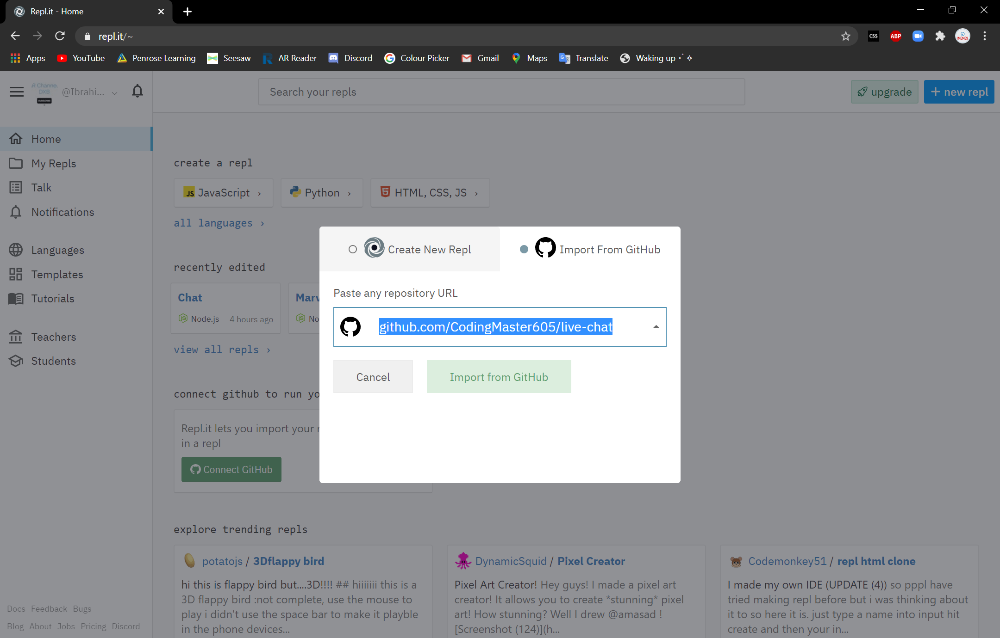
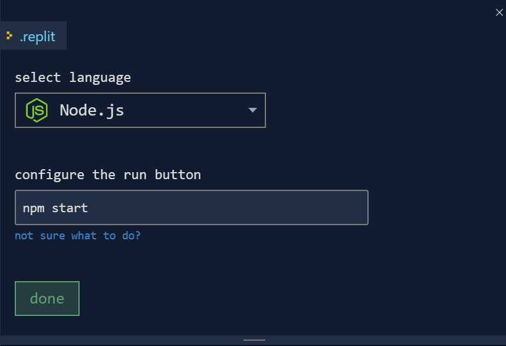

# Hey there! 👋

## WARNING: 

This  Live Chat is still under work so it will not work.

# What this is:

This is just a simple Live Chat! You can chat with your friends with this and hang around!

# How to host it?

You may know a different way to host this... but here is where I think you should host it!

## 1.

First you will have to go to a website called: [repl.it](https://repl.it) (click here to access) where you can host repl's and other stuff. Please sign in to repl.it first.

Here is where you should be by now:

</img>

Or if you are logged in this is:

</img>


## 2.

Then you can simply click "+ new repl" on the top right

After that click Import From GitHub so click on that!

Then on the Import From GitHub page type in this:

## [github.com/CodingMaster605/live-chat](https://github.com/CodingMaster605/live-chat)

This is what you should have done by now:

</img>

## 3.

Then when you see this on your console:



Click "Done" and Connect your GitHub account if you want to!

After that click on "Import From GitHub" then wait for it to load and click "run" on the top.


This will start the command ``` npm start``` which we set up. 

It will then install yarn with this command:

```bash
yarn install
```

Now you can just make it fullscreen and chat with friends!!!

Thank you for using this Repo!

If you were having trouble you can simply click this:

[](https://repl.it/github/CodingMaster605/live-chat)

## Bye!
